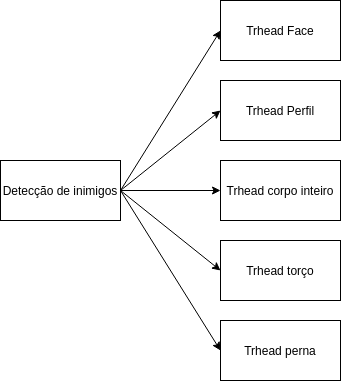
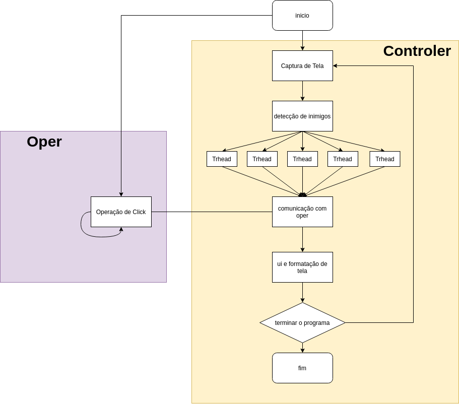

# reconhecimento
repositório do git dedicado ao estudo de algoritimos de reconhecimento facial, do corpo entre outros, com git

# Detecção de inimigos e automatização do tiro, no jogo left 4 dead 2, com algorítimos de reconhecimento e python

## N. Krüger

###### Este documento é um guia de como implementar um sistema de detecção de inimigos e automatização do tiro para jogo left 4 dead 2[], ou qualquer jogo de tiro no qual o inimigo seja humanoide. Utilizando de bibliotecas, em python[]. 

##### Introdução: O 1º passo para confecção do algorítimo, é a captura de tela, a partir desta poderemos detectar os inimigos. 2° detecção dos inimigos, 3° redimensionamento  das detecções, 4° verificação de colisão com o centro da tela(se tem algum inimigo na mira). 5º fazer com que o jogados atira caso o inimigo esteja na mira

###### Fig. 1 Fluxo simplificado do problema
##### Captura de tela: Para a captura de tela utilizou-se a biblioteca mss[3], que tem altas taxas de captura, podendo chegar 100 fps de pendendo do computador.

## pip install mss

##### Detecção dos inimigos: Para detecção dos inimigos utilizou-se de um função do openCV[4], chamada CascadeClasifier[5] que baseado em um xml que é passado como parâmetro para essa função, está pode ser utilizada para reconhecer o objeto especificado no xml em uma imagem. O que é detectado pela nossa função é a face, a face de perfil, o corpo inteiro, o torço e as pernas. Para fins de aumento de desempenho, um trhead é lançada para cada captura.

###### Fig. 2 trhreads de detecção 

##### Redimensionamento da detecção: A partir do reconhecimento de partes do corpo como a face, se tem um retângulo, que indica onde na imagem se tem uma face, a partir desse retângulo que sublinha a face é feito um redimensionamento, para a captura total do corpo.

###### Fig. 3 Redimensionamento de detecção. A imagem a cima mostra a detecção sem o redimensionamento e a imagem a baixo mostra a captura com redimensionamento. O quadrado verde ao centro mostra  o que seria a mira do jogador quando ele detecta a colisão do quadrado verde com a azul este passa a ser vermelho indicando que o inimigo está na mira

##### Verificação de colisão: a Verificação ocorre no momento que a imagem está sendo processada, casa algum dos retângulos colidam com quadrado no centro da tela o retângulo fica vermelho e indica que o inimigo está na mira.

##### Operação: A operação irá controlar o mouse caso um inimigo, esteja na mira irá atirar. Foi programado como uma trhead que corre junto com o programa principal, assim a operações de controle só indicam se o estado é atirando ou não atirando, foi pensado assim pois em uma operação sequencial com os 5 tipos de detecção o programa roda no máximo a 5 fps, o que nos daria no máximo 5 tiros por segundo em uma detecção com o inimigo na mira, como foi optado uma abordagem paralela o jogados se manterá atirando até que venha outra verificação e altere o estado de atirando para não atirando 

##### Diagrama de classes: Para confecção do programa este foi dividido em diversas classes.

##### *main: Classe principal que coordena as demais classes está classe é responsável pelas operações dinâmicas, em tempo real. É ela que define o fluxo de programa e como as demais classes devem se comportar.
##### *getImage: É classe responsável por fornecer a captura de tela as demais classes.
##### *procImage: É a classe responsável por processar imagem, ou seja é ela que vai identificar os inimigos na tela, ela que vai lançar as trheads que identificam partes de corpo que não são nada mais que outra classes(procThread) que serão criadas dentro da dessa classe. Também verifica colisão de e informa a main sobre isso.
##### *procTrhead: É a classe criada pela procImage, ela é responsável, por identificar a parte do corpo especificada, redimensionar, e indicar se ha colisão com o centro. Passando todas essas infirmações para a classe procImage.

###### Fig. 4 Relação proImage, procTrhead

##### *userInterface e ui: classes responsáveis por mostrar na tela informações sobre o estado do programa.
##### *formaImg: Altera a formatação de imagem e joga para saída
##### *oper: Responsável por controlar o mouse para fazer o jogador atira. É uma Trhead que roda em paralelo com o fluxo principal do programa.

###### Fig. 5 Diagrama de Classes

##### Fluxo completo do programa: Junto com fluxo principal do programa, corre em paralelo através de uma trhead a operação que vai acionar o click do mouse, que vamos chamar de oper. A oper e controlada pelo fluxo principal que vamos chamar de controler, é o controle que vai indicar quando é para acionar o click ou não.
##### Na operação de controle ocorrem diversas etapas, primeiro ele captura a tela, após ocorre o processamento da imagem, onde cinco trheads são lançadas com o objetivo de melhorarem o desempenho na operação de busca.A comunicação com a oper é feita e em seguida informações relacionadas com o estado  do programa são dispostas na tela, depois ocorre a formatação da imagem que será disposta na saída.

###### Fig. 6 Fluxo Completo

##### Analise de resultados: Aplicando todas as técnicas de paralelismo associado a um algorítimo de captura de tela de alto desempenho, esse programa de auxilio ao jogador se torna útil. Com somente uma trhead de captura, o programa atinge uma taxa de 25 fps, e como a captura de torço corresponde a 60% de todas as capturas, se torna uma boa opção lançar o algorítimo com somente um trhead. Porém a opção que vai deixar o jogo melhor jogável é a com 5 trheads com todos os tipos de captura apesar de que assim o programa rode a 5 fps.

##### Informação sobre o autor: Este estudo foi feito pelo aluno do nono semestre(2020/1) de engenharia da Computação da Unisinos Nícolas Krüger, para a cadeira de processamento digital de sinais(prof.: Jean Schmith). O objetivo do trabalho fazer uso dos conhecimentos aprendidos na discipliná em uma aplicação de escopo livre. 

##### Conclusão: É possível através da captura de tela o uso de trapaça em games. Apesar de jogável, essa aplicação, não se tornou tão benéfica para o jogador que a utilizará, pois os algorítimos de captura são muito lentos, o que causa uma perda na taxa de dados que seria o ideal ser capturado(30 fps). Além de que esse algorítimo não é muito preciso, gerando vários falsos positivos, também é difícil o redimensionamento pois as proporções divergem de captura para captura.  

##### N. Krüger (aluno Unisinos: )

##### E-mail: nicolas.nkruger@gmail.com

#### References
##### 1. https://store.steampowered.com/app/550/Left_4_Dead_2/ acessado dia 10 – 18/05/2020
##### 2.  https://matplotlib.org/tutorials/introductory/pyplot.html acessado dia 15-18/04/2020
##### 3.   https://pypi.org/project/mss/ acessado dia 10 – 18/05/2020
##### 4.   https://opencv.org/ acessado dia 10 – 18/05/2020
##### 5. https://medium.com/data-science-br/reconhecimento-facial-em-python-com-a-biblioteca-opencv-be500c3ebcb3 acessado dia 10 – 18/05/2020

